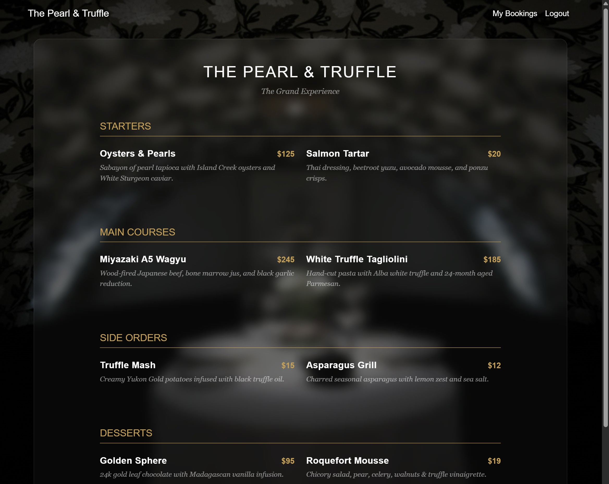
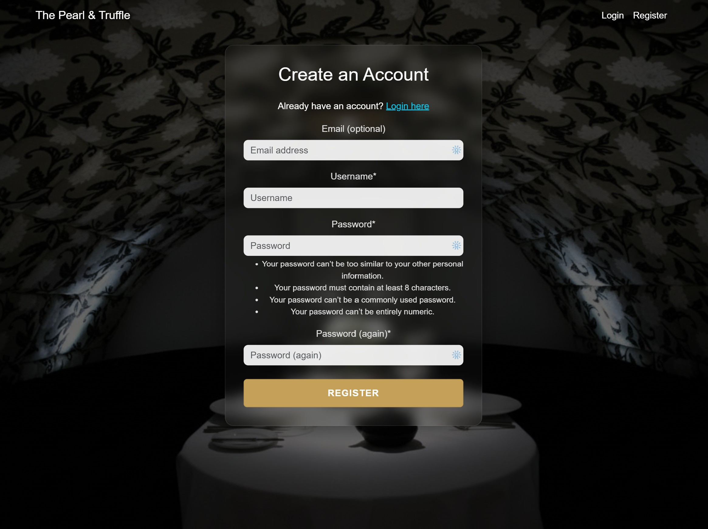
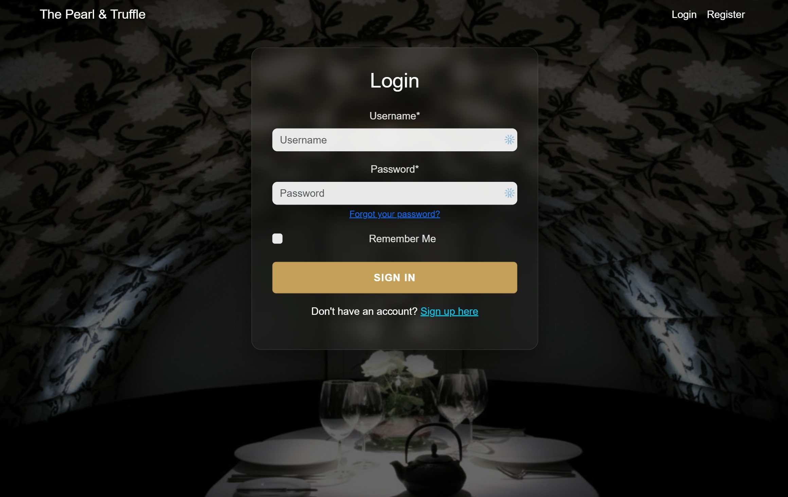
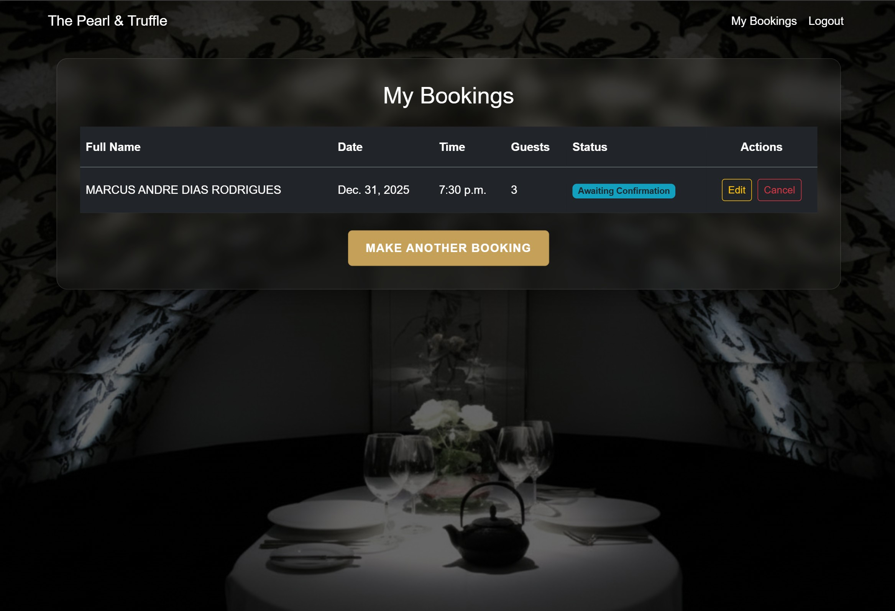
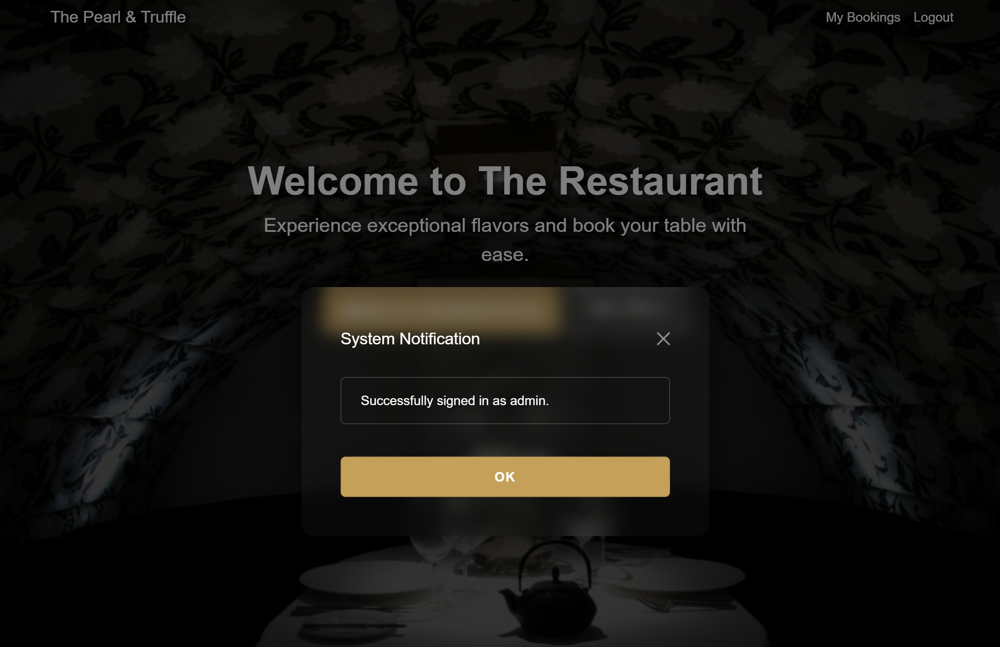
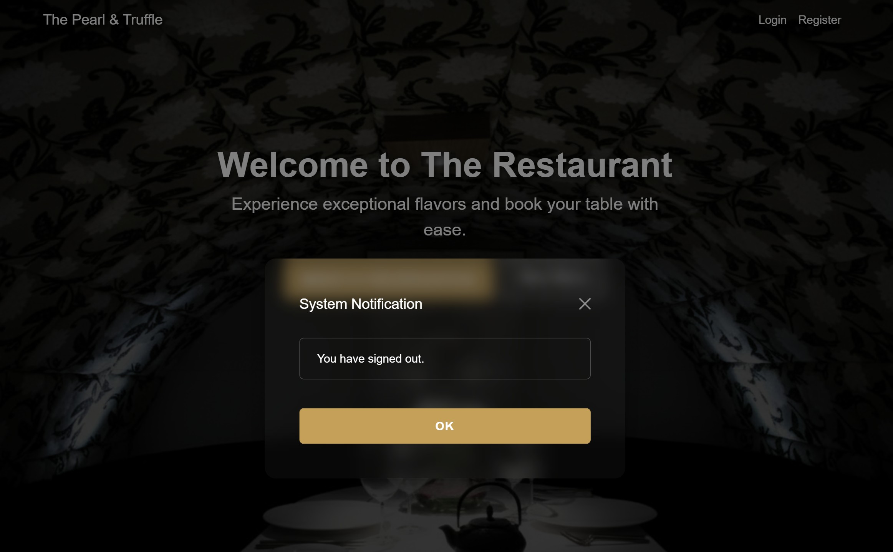
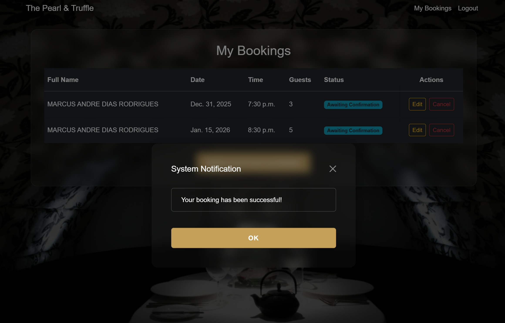
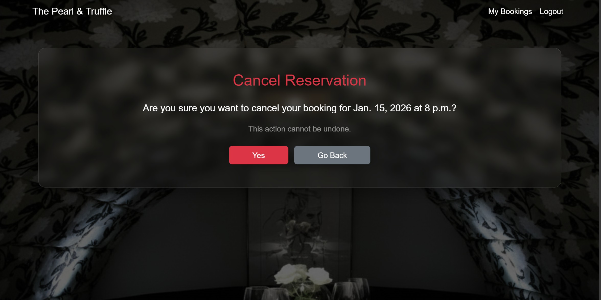
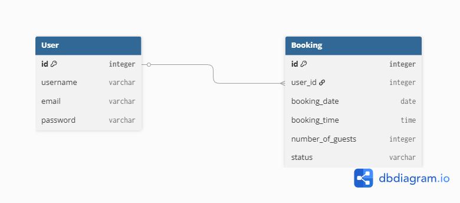

# The Pearl & Truffle - Restaurant Booking System

The Pearl & Truffle is a luxury, full-stack restaurant booking application. It provides a seamless reservation experience for customers and a robust management tool for restaurant staff.

[Live Project Link](https://pearl-and-truffle-booking-860a3739edd9.herokuapp.com/)

---

## 📸 Responsive Design & Mockups
The Pearl & Truffle is designed to be fully responsive, ensuring an elegant experience across desktops, tablets, and mobile devices.


---

## 📖 Project Rationale & User Stories
This project was developed to automate restaurant reservations, adding value by:
* Providing 24/7 booking availability for users.
* Streamlining staff operations through a secure admin interface.

### Agile Methodology
This project was developed using Agile principles. Feature implementation was planned and tracked using GitHub Projects.
You can view the full Kanban board and user stories here: [Restaurant Booking System Board](https://github.com/users/marcus-andre/projects/4/views/1)

### User Stories
* **As a user**, I want to navigate the site intuitively to find restaurant information.
* **As a user**, I want to register and manage my own bookings (create, edit, delete).
* **As an admin**, I want to monitor all reservations to prevent overbooking.

---

## 🌟 Features & User Experience

### 1. Home Page / Hero Section
The landing page features a captivating hero image (AI-generated for copyright compliance) that sets the tone for a high-end dining experience.


### 2. The Menu
The menu section displays the restaurant's offerings with a clear hierarchy of starters, main courses, and sides, including pricing.



### 3. User Authentication
Utilizing **Django-allauth**, users can securely register and log in to access the booking features.

| Feature | Screenshot |
| :--- | :--- |
| **Registration** |  |
| **Login** |  |

### 4. Booking System (CRUD)
Logged-in users can select dates and times for their party. The system supports full CRUD functionality, allowing users to view, update, or cancel their reservations at any time.




### 5. System Feedback (User Notifications)
The application provides immediate feedback for all user interactions, ensuring the user is always aware of the system's status. This includes success messages for authentication and CRUD operations.

* **Authentication Feedback**:
    
    

* **Booking Feedback**:
    
    

### 6. Booking Management & Defensive Design
Users have full control over their reservations with a dedicated edit interface. To prevent accidental data loss, the system employs defensive design principles by requesting confirmation before destructive actions.

* **Edit Reservation**: Users are presented with a pre-filled form to easily modify their booking details.
    

* **Defensive Design (Confirmation Modals)**: Before logging out or deleting a booking, a modal appears to confirm the user's intent.
    
    
---

## 🗄️ Data Model

The project uses a relational database (PostgreSQL). The primary custom model is **Booking**, which is linked to the standard Django **User** model.



> *The Entity Relationship Diagram (ERD) above was designed using dbdiagram.io to illustrate the relationship between User and Booking models.*

### Project Structure & Organization
* **Documentation Directory**: A dedicated `documentation/` folder was created to store screenshots, mockups, and planning assets used in this README. This decision was made to keep the production `static/` folder clean and optimized, ensuring it contains only files necessary for the deployed application's performance.

## 🛠️ Technical Stack & Tools
Based on the project's requirements, the following tools were implemented in the virtual environment:

| Tool | Purpose |
| :--- | :--- |
| **Django (4.2.17)** | The core framework used for the application logic. |
| **Gunicorn** | WSGI HTTP Server used for production on Heroku. |
| **Cloudinary** | Cloud service used to serve optimized media assets. |
| **Django-Cloudinary-Storage** | Manages storage for both media and static assets (CSS/JS) without needing WhiteNoise. |
| **Psycopg2-binary** | PostgreSQL database adapter for Python. |
| **Django-allauth** | Handles user authentication and account management. |
| **Django-Crispy-Forms** | Controls the rendering of forms using Bootstrap 5 styling. |

---

## 🗄️ Database Schema
The project uses a relational database (PostgreSQL). Below is the Entity Relationship Diagram (ERD) detailing the relationships between the User and Booking models.


## 🚀 Deployment Procedure

The project was deployed using **Heroku**. The live link can be found here: [Pearl & Truffle Live Site](https://pearl-and-truffle-booking-860a3739edd9.herokuapp.com/)

### Prerequisites
To deploy this project, you need:
1.  A **Heroku** account.
2.  A **Cloudinary** account (for hosting static and media files).
3.  A **PostgreSQL** database (provided by Code Institute).

### Deploying to Heroku
The following steps were taken to deploy the application:

1.  **Prepare the Environment**:
    * Created a `requirements.txt` file using `pip freeze > requirements.txt` so Heroku knows which packages to install.
    * Created a `Procfile` containing `web: gunicorn restaurant_booking.wsgi` to instruct Heroku how to run the app.

2.  **Create the Heroku App**:
    * Logged into Heroku and clicked **"New"** -> **"Create new app"**.
    * Chose a unique name (`pearl-and-truffle-booking`) and selected the **Europe** region.

3.  **Configure Environment Variables (Config Vars)**:
    * Navigated to the **Settings** tab and located the **"Config Vars"** section.
    * Clicked **"Reveal Config Vars"** and added the following keys:
        * `DATABASE_URL`: The URL provided by the **Code Institute** PostgreSQL instance.
        * `SECRET_KEY`: A secret key for Django security.
        * `CLOUDINARY_URL`: The API Environment variable from the Cloudinary dashboard.
        * `DISABLE_COLLECTSTATIC`: `1` (Temporary, used only during initial deployment if static files cause issues).

4.  **Connect to GitHub**:
    * Navigated to the **Deploy** tab.
    * Selected **GitHub** as the deployment method.
    * Searched for the repository `restaurant-booking-system` and clicked **Connect**.

5.  **Manual Deploy**:
    * Scrolled down to the **"Manual deploy"** section.
    * Selected the `main` branch and clicked **"Deploy Branch"**.
    * Once finished, a "Your app was successfully deployed" message appeared with a button to view the live site.

---

### 💻 Local Development

#### How to Fork
To contribute to this project without affecting the main repository:
1.  Log in to GitHub and navigate to the repository.
2.  Click the **"Fork"** button in the top-right corner.
3.  You will now have a copy of the repository in your own GitHub account.

#### How to Clone
To run the project locally on your machine:
1.  Navigate to the repository on GitHub.
2.  Click the **Code** button and copy the HTTPS link.
3.  Open your terminal/command prompt.
4.  Run the command:
    ```bash
    git clone [https://github.com/YOUR-USERNAME/restaurant-booking-system.git](https://github.com/YOUR-USERNAME/restaurant-booking-system.git)
    ```
5.  **Install Dependencies**:
    Navigate into the project folder and install the required packages:
    ```bash
    pip install -r requirements.txt
    ```
6.  **Environment Variables**:
    Create a file named `env.py` in the root directory and add your keys (do not upload this file to GitHub):
    ```python
    import os
    os.environ["DATABASE_URL"] = "your_db_url_here"
    os.environ["SECRET_KEY"] = "your_secret_key_here"
    os.environ["CLOUDINARY_URL"] = "your_cloudinary_url_here"
    ```
7.  **Run the Server**:
    ```bash
    python manage.py runserver
    ```

---

## 🐞 Fixed Issues & Troubleshooting
Documentation of critical fixes during development:

* **Procfile Error**: Re-created the file with ASCII encoding to solve Heroku parsing issues.
* **400 Bad Request**: Resolved by adding `.herokuapp.com` to `ALLOWED_HOSTS`.
* **Asset 404**: Fixed by using the `` tag to resolve hashed filenames generated by Cloudinary.

---

## 🧪 Testing & Validation
Due to the comprehensive nature of the testing procedures, all validation results (HTML, CSS, Python PEP8), manual test cases, and device compatibility checks are documented in a separate file.

Please refer to [TESTING.md](TESTING.md) for full details.

---

## ⚖️ Credits & Educational Notes

### Content & Media
* **Images**: Images used in this project are for educational purposes. Hero image was AI-generated to ensure copyright compliance.
* **Design**: Custom gold palette (color: #c5a059) implemented via `style.css`.

### Acknowledgements
* **Gemini Pro**: Used as a virtual assistant for debugging code logic, checking PEP8 compliance, and refining the documentation text.