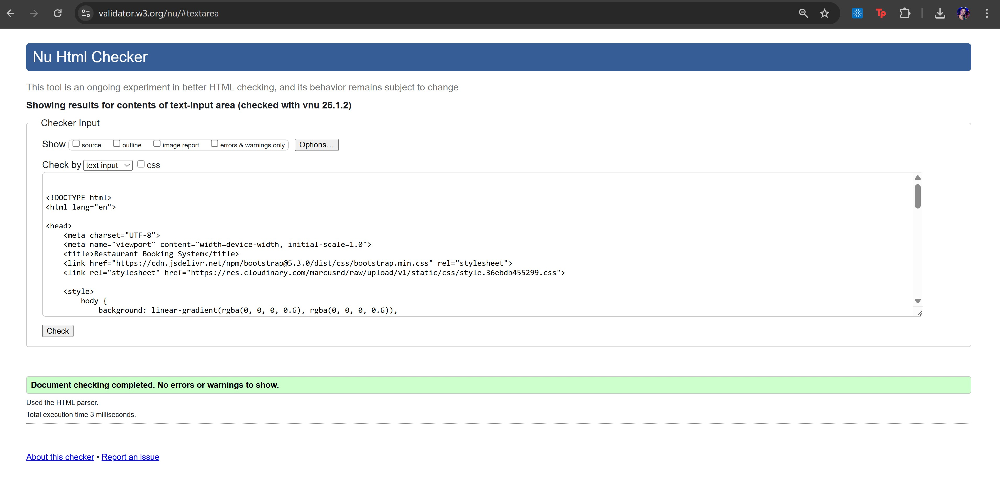
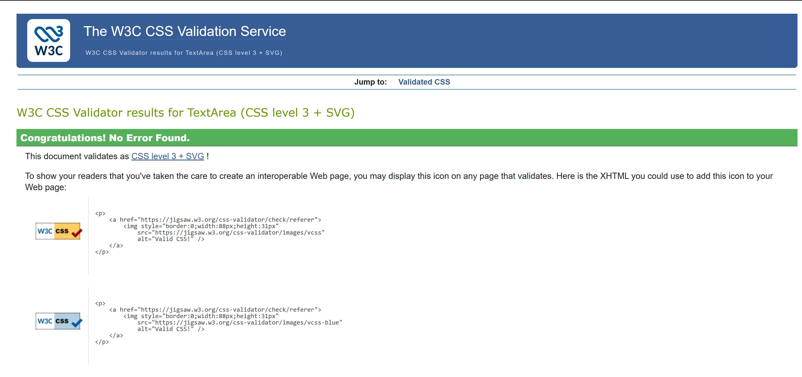

# Testing & Validation

Return to [README.md](README.md)

## ✅ Code Validation

### HTML Validation (W3C)
To ensure compliance, the HTML code was validated using the [W3C Markup Validation Service](https://validator.w3.org/).

**Methodology**:
Since Django templates (`.html`) contain Jinja2 logic that creates false errors in the validator, the validation was performed by:
1. Opening the live deployed page.
2. Right-clicking to "View Page Source".
3. Copying the raw rendered HTML into the W3C Validator via "Direct Input".

**Result**:
No errors were found in the custom code across key pages.

**Summary of Checked Pages**:

| Page | Result | Notes |
| :--- | :--- | :--- |
| **Home Page** | ✅ Pass | Screenshot above |
| **Register / Login** | ✅ Pass | Allauth forms render correctly |
| **Booking Form** | ✅ Pass | CSRF tokens and form fields are valid |
| **My Bookings** | ✅ Pass | Table structure is valid |
| **Edit Booking** | ✅ Pass | Pre-filled values render correctly |

### CSS Validation (Jigsaw)
The CSS file was tested using the [W3C Jigsaw Validator](https://jigsaw.w3.org/css-validator/).
* **Result**: Passed with no errors.

### Python Validation (CI Linter)
All custom Python files were checked using the **Code Institute Python Linter** to ensure compliance with PEP8 standards.

**Methodology**:
I manually copied the code from each python file and pasted it into the CI Python Linter.

**Result**:
All files passed with no critical errors.
* *Note: `settings.py` may contain "line too long" warnings due to unavoidable Django configuration strings (like AUTH_PASSWORD_VALIDATORS), which is acceptable practice.*

**Evidence (Example: `views.py`)**

**Summary of Checked Files**:

| File | Result | Notes |
| :--- | :--- | :--- |
| **booking/views.py** | ✅ Pass | Zero errors |
| **booking/models.py** | ✅ Pass | Zero errors |
| **booking/forms.py** | ✅ Pass | Zero errors |
| **booking/urls.py** | ✅ Pass | Zero errors |
| **booking/admin.py** | ✅ Pass | Zero errors |
| **restaurant_booking/urls.py** | ✅ Pass | Zero errors |

---

## ⚡ Performance & Accessibility (Lighthouse)

The deployed application was audited using Google Chrome's built-in **Lighthouse** tool to assess performance, accessibility, and best practices.

**Summary of Results:**
The application achieved high scores across all metrics, ensuring a fast and accessible user experience.

* **Performance:** 99
* **Accessibility:** 95
* **Best Practices:** 100
* **SEO:** 90

> *Note: Accessibility scores were optimized by implementing high-contrast text and ensuring all interactive elements (buttons, links) utilize proper `aria-labels` for screen readers.*

## 🧪 Manual Testing

Extensive manual testing was conducted to ensure the system functions as expected.

### User Authentication & Accounts
| Feature | Action | Expected Result | Pass/Fail |
| :--- | :--- | :--- | :--- |
| **Registration** | Submit form with valid details | Account created, user logged in, success message appears | **Pass** |
| **Registration** | Submit with existing email | Error message: "Email already in use" | **Pass** |
| **Login** | Enter valid credentials | User logged in, redirected to home | **Pass** |
| **Login** | Enter invalid password | Error message displayed | **Pass** |
| **Logout** | Click 'Logout' button | Modal confirmation appears -> User logged out | **Pass** |

### Booking System (CRUD)
| Feature | Action | Expected Result | Pass/Fail |
| :--- | :--- | :--- | :--- |
| **Create Booking** | Submit valid date/time | Booking saved, appears in "My Bookings" | **Pass** |
| **Past Dates** | Try to book a past date | Validation error: "You cannot book in the past" | **Pass** |
| **Edit Booking** | Change guest number | Database updates, success message shown | **Pass** |
| **Cancel Booking** | Click 'Cancel' | Confirmation modal appears -> Booking deleted | **Pass** |
| **Double Booking** | Book same time/date again | Validation error preventing double booking | **Pass** |

### Navigation & UX
| Feature | Action | Expected Result | Pass/Fail |
| :--- | :--- | :--- | :--- |
| **Navbar** | Click all links | Correct pages open, active link highlighted | **Pass** |
| **Responsive Menu** | View on mobile | Navbar collapses into hamburger menu | **Pass** |
| **404 Page** | Enter invalid URL | Custom 404 error page displayed | **Pass** |

---

## 📱 Browser & Device Compatibility

The website was tested on the following browsers and devices to ensure cross-compatibility:

* **Browsers**: Chrome, Firefox, Microsoft Edge, Safari.
* **Devices**:
    * Desktop PC (1920x1080)
    * Laptop (1366x768)
    * Tablet (iPad Air)
    * Mobile (iPhone 12/13/14, Samsung Galaxy S20)

---

## 🐞 Bugs & Fixes

### Fixed Bugs
* **Bug**: Users could accidentally delete bookings without warning.
    * **Fix**: Implemented a defensive design modal (Bootstrap Modal) to ask for confirmation before deletion.
* **Bug**: Static files were not loading on Heroku deployment.
    * **Fix**: Configured `WhiteNoise` and Cloudinary storage correctly in `settings.py`.

### Known Issues
* There are currently no known critical issues hindering the application's core functionality.